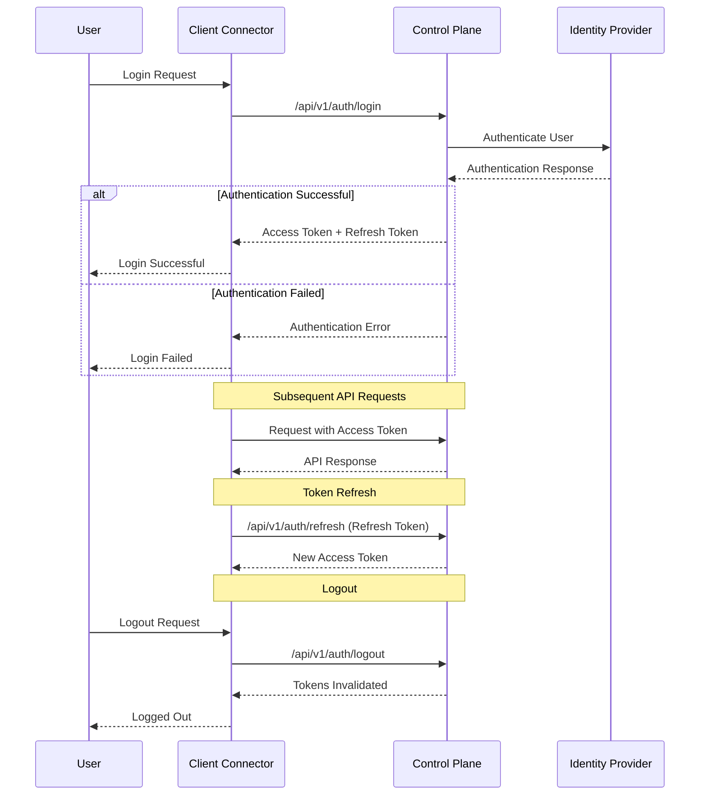
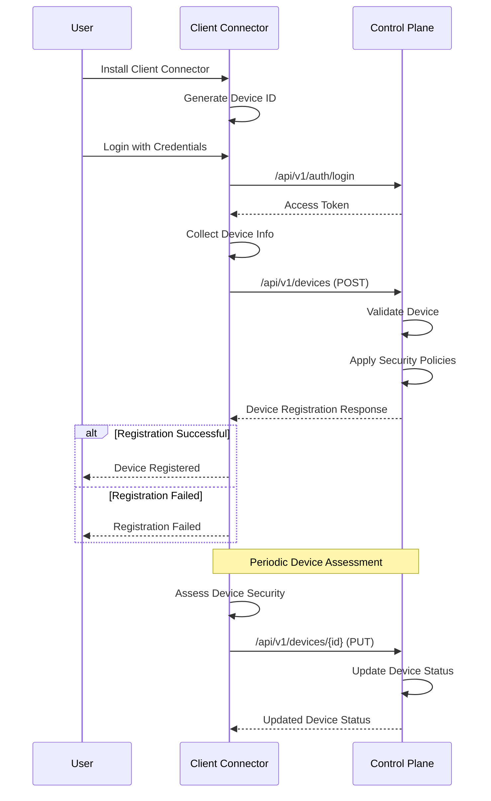
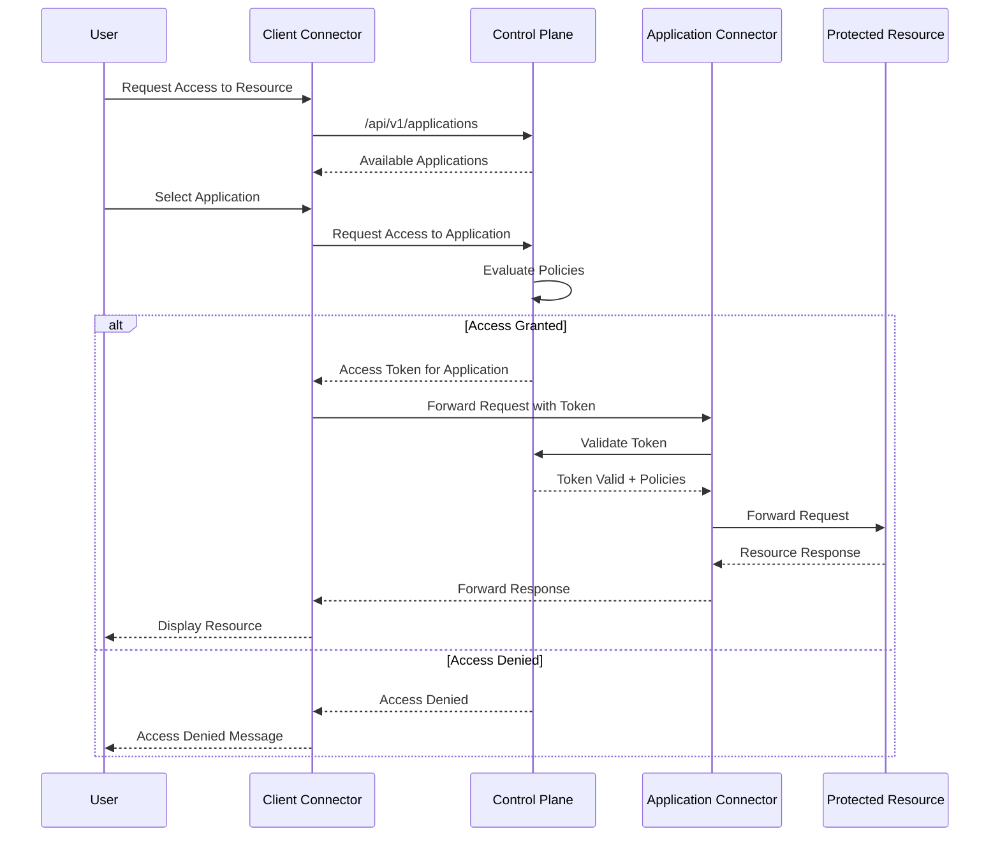

# Authentication Flow Diagram

## OAuth 2.0 Authentication Flow



## Device Registration Flow



## Access Control Flow



## Token Validation Flow

```mermaid
sequenceDiagram
    participant Client as Client/App Connector
    participant CP as Control Plane
    participant Cache as Token Cache
    
    Client->>CP: Request with Access Token
    CP->>Cache: Check Token
    
    alt Token in Cache
        Cache-->>CP: Token Valid
    else Token Not in Cache
        CP->>CP: Validate Token Signature
        CP->>CP: Check Token Expiration
        CP->>CP: Verify Token Claims
        CP->>Cache: Store Valid Token
    end
    
    alt Token Valid
        CP->>CP: Check Permissions
        CP-->>Client: Authorized Response
    else Token Invalid
        CP-->>Client: 401 Unauthorized
    end